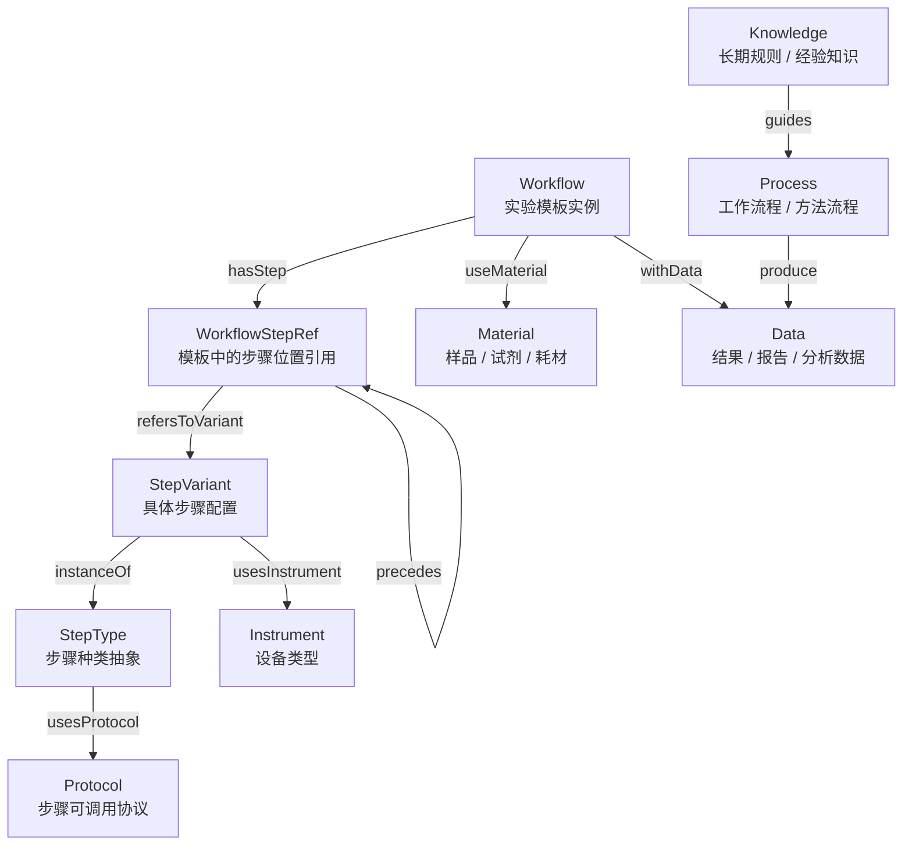

# Oasis Ontology Schema

## Overview

This file describes the structural schema of the current `oasis-ontology` graph.

It defines:

- entity types
- relation types
- the recommended structural connections between them

This is a schema-level diagram, not an instance-level workflow diagram.

## Entity Types

- `Workflow`
- `WorkflowStepRef`
- `StepType`
- `StepVariant`
- `Protocol`
- `Instrument`
- `Process`
- `Knowledge`
- `Data`
- `Material`

## Relation Types

- `hasStep`
- `refersToVariant`
- `instanceOf`
- `usesProtocol`
- `usesInstrument`
- `precedes`
- `guides`
- `useMaterial`
- `withData`
- `produce`

## Diagram

## Meaning

### `Workflow`

Represents one experimental template instance imported from a workflow system.

### `WorkflowStepRef`

Represents one step position inside a workflow.

This exists to separate:

- where a step appears in a workflow
- what concrete step configuration it refers to

### `StepType`

Represents a stable abstract step category, such as:

- incubation
- liquid handling
- imaging
- washing
- waiting

It is the right layer for describing:

- what parameters this class of step can edit
- what protocols this class of step can use

### `StepVariant`

Represents one concrete configuration of a `StepType`.

It is the right layer for describing:

- the current bound parameter values
- the current display name
- the current display device type name

### `Protocol`

Represents a callable protocol object used by step types and step variants.

### `Instrument`

Represents a device type, not a single physical machine instance.

### `Material`

Represents experimental resource objects such as:

- sample
- reagent
- consumable

### `Data`

Represents result-layer objects, such as:

- raw outputs
- reports
- analysis results

`Data` is not treated as a workflow-native node.

### `Process`

Represents an outer workflow, operational process, or analysis process.

### `Knowledge`

Represents reusable long-term rules and experience knowledge, such as:

- naming rules
- channel interpretation rules
- normalization rules
- analysis conventions

## Design Notes

- `StepType -> usesProtocol -> Protocol`
  expresses which protocols a class of step can use.
- `StepVariant`
  should keep the currently bound protocol value inside its own configuration fields, such as `variant_signature`.
- `Knowledge -> guides -> Process`
  expresses that a reusable rule set guides how a process should be executed, interpreted, or analyzed.
